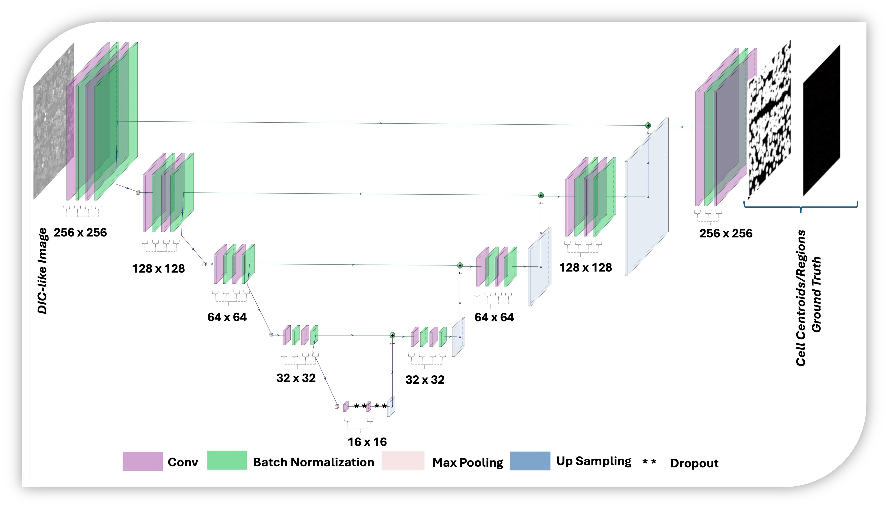

In this repository, we compare the performance of two networks( U-Net and Light-U-Net) on our subjective problem.

# Project Title
A Hybrid Framework for Effective Microscopic Cell Counting & Segmentation Integrating Light-U-net with Watershed

---

## Table of Contents
- [Overview](#overview)
- [Installation](#installation)
- [Dataset](#Dataset)
- [Pre-processing](#Pre-processing)
- [Networks](#Networks)
- [Deep Learning Methodologies](#Deep)
- [Counting Methodologies](#Counting)
- [Evaluation](#Evaluation)
- [License](#refrences)
- [Contact](#contact)

---


## Overview

This repository offers an optimized deep learning method for retinal ganglion cell (RGC) counting and segmentation. It introduces advanced pre-processing techniques for both input and label datasets, along with an efficient Light-U-Net model. The repository includes a synthetic dataset and a self-generated dataset of whole-mounted mouse retina images. 
We evaluate the proposed Light-U-Net model against the standard U-Net across both datasets and compare various counting and segmentation methods. Two types of label pre-processing are used to generate region and centroid label sets. 
Local maxima, connected component, watershed, and feature-based counting methods (LoG, DoG, DoH) are applied to both Light-U-Net and U-Net predictions to facilitate a fair comparison. 
The results demonstrate the model's robustness and suitability for RGC analysis under varying imaging conditions.

---


## Installation

To run the training phase of this code, you'll need to set up a specific environment with the required dependencies. Follow these steps to create the environment:

1. Create the conda environment with the required TensorFlow version and additional dependencies:

   ```bash
   conda create -n tf-gpu-env tensorflow-gpu numpy=1.23.5

2. Activate the environment:

   ```bash
   conda activate tf-gpu-env

3. Once the environment is set up and activated, you can proceed with installing the  dependencies  and then training the code.

   ```bash
   bash install_dependencies.sh
   ```

    Or you can use:

    ```bash
    pip install -r requirements.txt
    ```

---


## Dataset

Both real and synthetic datasets are provided in ***real_dataset*** and ***synth_dataset*** folder of  this repository. 
The custom dataset, collected by Dalhousie University’s Department of Ophthalmology.
the subfolders in each include :

1. cells : input images
2. dots : annotated label images

## Pre-processing 
all pre-processing steps are visualized in ***visulize the preprocessing steps*** folder.


## Networks
The data augmentation code is provided in ***generator.ipynb*** file. 
Both the training codes of Light-U-Net and U-net are provided. The models architectures are provided in model.ipynb file.
  
*Figure 1: Architecture of U-Net*

  
*Figure 2: Architecture of Light-U-Net*

## Deep Learning Methodologies

The methodology is presented below:  
  
*Figure 3: Framework of the proposed methodology*

## Counting Methodologies 

All the counting methodologies (local maxima, connected component, watershed, LoG , DoG, DoH ) codes are provided under ***counting codes*** folder.
The output results are coded to be saved under the dataset folder.

## Evaluation

All evaluation techniques (ICC, IoU) are provided in ***evaluation methods***.
The output results are coded to be saved in the same directory.

## Refrences
1. N. Y. Gharaei, N. Gaikwad, D. Upadhyay, S. Sampalli, B. C. Chauhan, and A. J. Jamet. Comparative evaluation of deep learning architectures for retinal ganglion cell counting: FCRN-A, FCRN-A-v2, and U-Net. In 2024 International Conference on Machine Learning and Applications (ICMLA), Miami, FL, USA, Dec. 2024. Accepted for publication.

## Contact
Let me know if you need help with any specific section or adding more details! you can contact with us using the following email address:
1. Narges.yarahmadi@dal.ca

